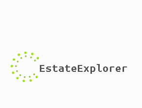

# real-estate-website-capstone-project

## EstateExplorer

Hello, and welcome to my capstone project. In this project, I will be showcasing all the skills and competencies I've learned over the long two years of dedication. The focus of the project is to present a complete real estate website with all the necessary functions for an excellent user experience. Here, you will have the possibility to:
- search for properties, filtering your search by location, price, size, among other filters to enhance the customer experience.

- other vital functionalities such as user authentication, property management (for sellers and buyers), and even a feature where you can find the property you're looking for on the map!

 Quite an experience, isn't it? So, let's get started!

## Looking for the BEST real estate Platform? Check it out:

- The real estate market is almost always missing a user-friendly platform where buyers, sellers, renters, and real estate agents can all connect at the same time. As a buyer, whenever you search for properties on one of the millions of real estate websites, you often run into small problems while looking for your dream home—like inadequate filters, incorrect price listings, and even houses that are no longer available. Sellers and real estate agents often struggle with managing their listed properties and communicating with potential clients. There are a few questions you can find yourself recieving from the end-user of your website, for example:

## User Stories

- **As a buyer/renter, I want to search for properties using specific filters so that I can find homes that meet my criteria.**

 - Users can filter properties by location, price range, property type, number of bedrooms/bathrooms, and amenities.
- Users receive a list of properties that match all selected filters.
- The system displays a message if no properties match the criteria.

- **As a buyer/renter, I want to view property locations on an interactive map so that I can assess the neighborhood and proximity to amenities.**

- Users can use the interactive map to check for amenities around the property
- Users can search throught the interactive map

- **As a seller/agent, I want to create and manage my property listings so that I can effectively market properties to potential buyers/renters.**

- Users can manage property listings through a dashboard

- **As an admin, I want to approve or reject new property listings to ensure all content on the site meets our standards.**

-accept/reject property inquiries from sellers/agents and organize them accordingly.

- **As a user, I want to securely log in and manage my profile so that my personal information is protected.**

- Users upon creation of the account will be recieving a hash password from bcrypt and JWT Tokens for better security.

As you can see,  we need an integrated solution that brings all of this together on one screen! And that's exactly what we're aiming to solve with this project!

## Project Features

- **User Auth**: Registration and login function using e-mail/password | role-based access for buyers/renters/sellers/agents/admins | password reset function

- **Property Listings**: Search bar with filter function | detail property page | property management for sellers/agents

- **Interactive Map**: display property locations | search directly through the map

- **Inquires & Contact**: forms for interested buyers/renters to contact the listing agent directly

- **Property Comparison Tool**: Compare properties features side-by-side

- **Admin Dashboard**: approve/reject property listings | manage user accounts | website analytics (basic)

- **Additional Feautes (This is a challenge - might not be added!)**: payment integration | reviews and ratings | internal messaging system | 

## Project Structure

- **front-end/**: front-end source code 
-**back-end/**: back-end source code 

## Technical Stack used

**Front-end:/** 

- **React/** for building the interactive UI 
- **Simple CSS/** for styling 
- **Mapbox/** for the interactive map feature 
- **Fetch API//** for requests to the backend 

**Back-end:/** 

- **Node.js/** for API requests 
- **RESTful APIs/** for the management of property listings, user and inquiries 
- **MySQL/** to store data 
- **Simple database-stored user auth/** for first auth and security 

## Deployment 

- **AWS/** 

## Documentation

- [(ERD, DML, DDL)](docs/ERD.md)

