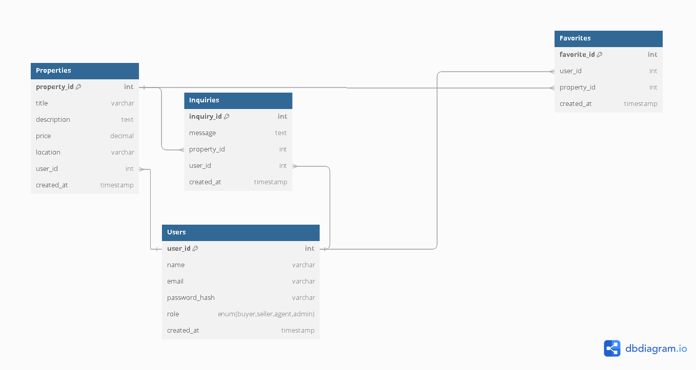

# Documentation - ERD 

Data structure for the website

## Intel

- **Users**: Represents the users of the platform. Users can be buyers, sellers, or agents.
- **Properties**: Represents the properties listed on the platform. Each property is linked to a user (seller/agent).
- **Inquiries**: Represents inquiries made by users (buyers) about properties.
- **Favorites**: Represents the many-to-many relationship between users and their favorited properties.

# DDL Explained

## Users
- **stores all the user information**
- `user_id`: PK. Unique for every user.
- `email`: Must be unique for each user.
- `role`: type of user (buyer, seller, agent, admin)

## Properties
- **stores properties listed by the user**
- `property_id`: PK for properties.
- `user_id`: FK that links to the **Users** table.

## Inquiries
- **tracks inquiries made by buyers about properties**
- `inquiry_id`: PK.
- `user_id`: FK that links to **Users** (the buyer).
- `property_id`: FK that links to  **Properties**

## Favorites
- **intermediate table for M-M relationship**
- `favorite_id`: PK.
- `user_id`: FK that links to **Users**
- `property_id`: FK that links to **Properties**

# DML Explained

## Insert
- insert new user
- insert new property
- insert new inquiry
- insert favorite

## Select
- select all users
- select all properties
- select all inquiries for a property
- select favorites for a user

## Update
- update property details
- update user role

## Delete
- delete a user
- delete a property
- delete an inquiry
- delete a favorite

## Documentation

 - ERD Website: [https://dbdiagram.io](https://dbdiagram.io)
  -ERD Documentation: [dbdiagram Documentation](https://docs.dbdiagram.io)