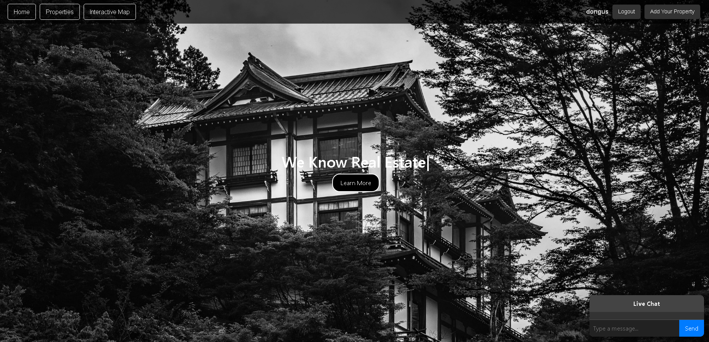
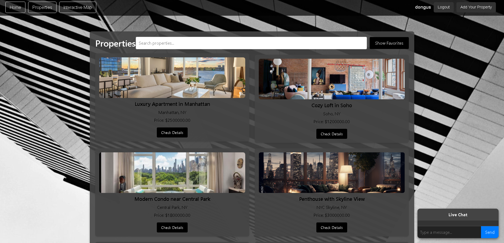
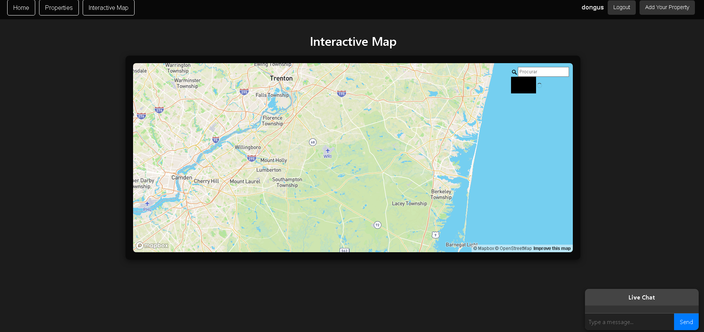

# Project Showcase: Real Estate Website

Welcome to the showcase of the Real Estate Website. This document highlights the core features of the project along with screenshots for better understanding.

---

## Table of Contents
1. [Homepage](#homepage)
2. [Properties Page](#properties-page)
3. [Interactive Map](#interactive-map)
4. [Live Chat](#live-chat)
5. [User Functionalities](#user-functionalities)

---

## Homepage

The homepage introduces users to the platform with a hero section, a list of featured properties, and quick navigation to key features.

---

## Properties Page

The properties page displays all available listings in a well-structured layout. Users can search, filter, and view property details. 

### Key Features:
- View property details.
- Add properties to favorites.
- Navigate to detailed property pages.

---

## Interactive Map

The interactive map allows users to explore properties visually on a map. Clicking on a property marker shows a quick overview and navigates to the property details.

### Key Features:
- Real-time marker interaction.
- Integrated with Mapbox for enhanced mapping functionality.

---

## Live Chat

Users can communicate in real-time using the live chat functionality.

### Key Features:
- Real-time communication powered by Socket.IO.

---

## User Functionalities

### Buyers:
- Browse properties and view details.
- Save properties to their favorites list.
- Communicate with agents via chat or inquiries.

### Sellers/Agents:
- Add new property listings.
- Manage their listed properties.
- Respond to inquiries received.

---

## How to Use the Platform

1. **Login or Sign Up**:
   - Users can log in or sign up to access personalized features.

2. **Browse Properties**:
   - Navigate to the **Properties** page to explore all available listings.
   
3. **Interactive Map**:
   - Use the map to locate properties visually and access detailed information.

4. **Live Chat**:
   - Communicate with other users through the live chat widget.

---

## Future Updates

Here are some planned updates to enhance the platform further:
- Private chat rooms between buyers and agents.
- Enhanced filtering and search capabilities.
- Integrated payment gateway for transactions.

---

**Thank you for exploring the Real Estate Website!**
